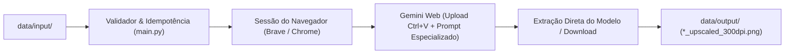

# 🤖 Gemini Upscaler RPA — Studio Kustom

Automação em **Python com Playwright** para otimização, restauração e upscaling em lote de artes e imagens de baixa resolução via interface web do **Google Gemini**, voltada para o fluxo de produção de produtos físicos personalizados em alta qualidade (**300 DPI**).

---

## 📌 Visão Geral & Arquitetura

O projeto resolve o desafio de preparar arquivos de clientes com resoluções baixas ou com artefatos de compressão para impressão física profissional. A automação envia a imagem para o Gemini Web com prompts técnicos especializados por perfil de produto, aguarda a geração da IA e extrai a imagem resultante em resolução máxima nativa.



---

## 🎯 Perfis de Produtos Suportados

A aplicação possui configurações dimensionais e prompts de IA especializados para cada categoria de produto:

| Perfil (`--product`) | Nome de Exibição | Dimensões Finais | Foco do Prompt de IA |
| :--- | :--- | :--- | :--- |
| **`POSTER_A4`** | Pôster Formato A4 | 210 x 297 mm | Fidelidade de cores, remoção de ruído JPEG e nitidez equilibrada sem artefatos. |
| **`POSTER_A3`** | Pôster Formato A3 (Grande Formato) | 297 x 420 mm | Super-resolução para grande escala, reconstrução de microdetalhes e eliminação de banding de gradientes. |
| **`TRADING_CARD`** | Trading Card Colecionável | 63.5 x 88.9 mm | Nitidez extrema de tipografia pequena, bordas vetoriais e contraste de símbolos e frames. |
| **`POLAROID`** | Foto Estilo Polaroid | 88 x 107 mm | Preservação de textura fotográfica natural, tons de pele e filme orgânico sem suavização excessiva. |
| **`MUG`** | Caneca Cerâmica (Panorâmica) | 200 x 95 mm (~2:1) | Preservação da proporção sem estiramento anamórfico e saturação otimizada para sublimação térmica. |

---

## 🛡️ Principais Recursos

- **Conexão Direta ao Brave (CDP)**: Suporte a Chrome DevTools Protocol na porta `9222`, reaproveitando sua sessão pessoal e evitando telas de bloqueio de login do Google.
- **Upload Ágil via Clipboard (Ctrl+C / Ctrl+V)**: Injeta a imagem diretamente na caixa de chat como anexo sem depender de seletores instáveis de explorador de arquivos.
- **Isolamento de Contexto**: A cada imagem processada, aciona um novo chat limpo para evitar contaminação do histórico e estouro de janela de tokens.
- **Idempotência Inteligente**: Ignora automaticamente imagens que já possuem a versão correspondente gerada em `data/output/`.
- **Extração de Imagem do Modelo**: Filtra especificamente a resposta gerada pela IA, ignorando miniaturas da mensagem do usuário e extraindo os dados em alta velocidade.
- **Observabilidade**: Logs detalhados em tempo real no console e registrados em `data/logs/automation.log`.

---

## 📂 Estrutura de Diretórios

```text
upscaling-auto/
├── data/
│   ├── browser_profile/          # Perfil de sessão persistente
│   ├── logs/                     # Registros de log (automation.log)
│   ├── input/                    # Imagens de entrada por produto
│   │   ├── poster_a4/
│   │   ├── poster_a3/
│   │   ├── trading_card/
│   │   ├── polaroid/
│   │   └── mug/
│   └── output/                   # Imagens aprimoradas geradas (300 DPI)
│       ├── poster_a4/
│       ├── poster_a3/
│       ├── trading_card/
│       ├── polaroid/
│       └── mug/
├── src/
│   ├── __init__.py
│   ├── config.py                 # Enums, Pydantic Models, detecção de Brave e Prompts
│   ├── selectors.py              # Mapeamento centralizado de seletores DOM
│   ├── upscaler.py               # Motor de automação RPA Playwright
│   └── utils.py                  # Logger, verificação CDP, retry e clipboard
├── iniciar_brave.bat             # Script para abrir o Brave com porta de depuração 9222
├── init_session.py               # Script para login manual inicial
├── main.py                       # CLI principal de processamento em lote
├── requirements.txt              # Dependências do projeto
└── README.md
```

---

## ⚙️ Instalação e Pré-requisitos

### 1. Clonar o Repositório
```bash
git clone https://github.com/VictorRubinec/upscaling-auto.git
cd upscaling-auto
```

### 2. Instalar as Dependências
Recomenda-se o uso do Python 3.10 ou superior:

```bash
# Criar e ativar ambiente virtual (opcional)
python -m venv venv
venv\Scripts\activate   # Windows

# Instalar dependências
pip install -r requirements.txt

# Instalar navegadores do Playwright (se necessário)
playwright install chromium
```

---

## 🚀 Como Executar

### 1. Iniciar o Navegador (Brave com sessão ativa)
Para rodar usando sua conta Google já logada no Brave:

1. Feche as janelas normais do Brave.
2. Execute o arquivo [`iniciar_brave.bat`](iniciar_brave.bat) (ou rode no terminal):
   ```powershell
   .\iniciar_brave.bat
   ```
   *(O Brave abrirá na página do Gemini com a porta de automação habilitada).*

### 2. Adicionar Imagens de Entrada
Coloque as imagens (`.png`, `.jpg`, `.jpeg`, `.webp`) dentro da pasta correspondente em `data/input/<produto>/`.

### 3. Disparar a Automação

#### Processar um produto específico:
```powershell
# Pôster A4
python main.py --product POSTER_A4

# Pôster A3
python main.py --product POSTER_A3

# Trading Cards
python main.py --product TRADING_CARD

# Fotos Polaroid
python main.py --product POLAROID

# Canecas (Mug)
python main.py --product MUG
```

#### Processar todos os produtos com arquivos pendentes:
```powershell
python main.py --all
```

#### Argumentos Adicionais:
* `--headless`: Executa o navegador sem abrir janela visual.
* `--timeout <ms>`: Define o tempo limite por imagem em milissegundos (padrão: `180000` = 3 minutos).

---

## 📄 Licença

Projeto desenvolvido para uso interno da **Studio Kustom**.
