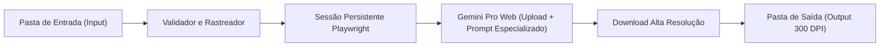

import { Timeline } from '../components/Timeline.jsx';
import { Badge } from '../components/Badge.jsx';
import { Callout } from '../components/Callout.jsx';
import { LinkCard } from '../components/LinkCard.jsx';

# Automação de Upscaling de Imagens via Gemini Web (Studio Kustom)

<Badge label="Studio Kustom" type="projeto" />
<Badge label="RPA & Automação" type="trabalho" />
<Badge label="Status: Ativo" type="info" />

## Visão Geral & Resumo

Arquitetura e desenvolvimento de robô RPA em Python com Playwright para otimização e upscaling em lote de artes e imagens de baixa resolução enviadas por clientes. O objetivo é automatizar a preparação de arquivos para impressão de alta qualidade (300 DPI) nos formatos A4, A3, canecas, polaroids e trading cards da Studio Kustom.

---

## Estrutura de Perfis e Prompts Técnicos

A automação é desacoplada por perfil de produto com especificações dimensionais e diretrizes para a IA:

| Perfil de Produto | Dimensões Finais | Foco do Prompt de IA |
| :--- | :--- | :--- |
| **`POSTER_A4`** | 210 x 297 mm (Vertical) | Fidelidade de cores, preservação de traços e nitidez sem artefatos. |
| **`POSTER_A4_HORIZONTAL`** | 297 x 210 mm (Horizontal) | Preservação fiel de cores e garantia de formato paisagem sem distorção. |
| **`POSTER_A3`** | 297 x 420 mm (Vertical) | Super-resolução com microdetalhes, eliminação de ruído e suavização de gradientes. |
| **`POSTER_A3_HORIZONTAL`** | 420 x 297 mm (Horizontal) | Super-resolução em grande escala adaptada estritamente para paisagem. |
| **`TRADING_CARD`** | 63.5 x 88.9 mm | Nitidez extrema de tipografia, bordas vetoriais e contraste de elementos visuais. |
| **`POLAROID`** | 88 x 107 mm | Preservação de textura fotográfica, correção suave de granulado. |
| **`MUG` (Caneca)** | 200 x 95 mm (Panorâmica) | Preservação de proporção 2:1 sem estiramento ou distorções no centro/bordas. |

<Callout title="Organização por Subpastas de Pedidos & Idempotência" type="info">
O robô agora suporta organização livre por subpastas em `data/input/<produto>/` (ex: `Pedido_101/arte.jpg`, `Pedido_102/arte.jpg`). A mesma hierarquia é reproduzida em `data/output/<produto>/`, evitando conflitos de arquivos de mesmo nome entre pedidos diferentes. Além disso, conta com detecção dinâmica de orientação (`horizontal` vs `vertical`) e calibração dimensional exata a 300 DPI.
</Callout>

---

## Linha do Tempo (Atualizações Cronológicas)

<Timeline items={[
  {
    date: "2026-10-05",
    title: "Suporte a Subpastas por Pedido e Resolução Exata a 300 DPI",
    content: "Implementada varredura recursiva de diretórios, espelhamento de subpastas no output (evitando conflitos de arquivos com o mesmo nome), calibração dimensional física com Pillow e perfis dedicados para pôsteres horizontais A4 e A3.",
    status: "Concluído"
  },
  {
    date: "2026-09-24",
    title: "Arquitetura e Desenvolvimento Inicial",
    content: "Definição do motor de automação Playwright com sessão persistente (User Data Dir), modelos de tipos com Enum e Pydantic, e prompts específicos para cada perfil de produto de personalizados físicos.",
    status: "Concluído"
  }
]} />

---

## 🔗 Assuntos Relacionados

- [`Monitor de Uptime`](../projetos/monitor-uptime-status.mdx) — Arquitetura de observabilidade e logs de automações.
- [`FontScout (Automação de Fontes)`](../projetos/automacao-busca-download-fontes.mdx) — Scripts Python para pipeline de design e tipografia.
